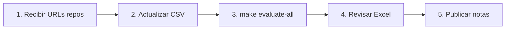

# 🎯 SISTEMA DE EVALUACIÓN KEDRO ML - GUÍA DEFINITIVA

## ✅ ARCHIVOS ESENCIALES DEL SISTEMA (NO BORRAR)

### 📁 Estructura Limpia y Organizada:
```
kedro-evaluator/
│
├── 📂 src/                          # Código principal
│   └── kedro_evaluator.py          # ⭐ EVALUADOR PRINCIPAL
│
├── 📂 examples/
│   └── rubrica_kedro.py             # ⭐ RÚBRICA 10 CRITERIOS
│
├── 📂 scripts/
│   ├── evaluate_batch.py           # ⭐ EVALUACIÓN MASIVA
│   └── validate_installation.py    # Validador del sistema
│
├── 📂 data/
│   └── estudiantes_kedro.csv       # ⭐ LISTA DE ESTUDIANTES
│
├── 📂 evaluaciones/                 # (Se crea automáticamente)
│   └── [resultados aquí]
│
├── 📄 setup.py                      # Configuración inicial
├── 📄 Makefile                      # ⭐ COMANDOS RÁPIDOS
├── 📄 requirements.txt              # Dependencias
├── 📄 config_kedro.json            # Configuración del sistema
├── 📄 .env                         # Variables de entorno (crear)
└── 📄 README.md                     # Esta documentación
```

---

## 🚀 INICIO RÁPIDO EN 3 PASOS

### PASO 1: Configurar Token de GitHub
```bash
export GITHUB_TOKEN="ghp_tu_token_aqui"
```

### PASO 2: Editar Lista de Estudiantes
Edita `data/estudiantes_kedro.csv`:
```csv
nombre,pareja,repositorio
Juan Pérez,María González,https://github.com/juanperez/proyecto-kedro
Ana Rodríguez,,https://github.com/anarodriguez/proyecto-kedro
```

### PASO 3: Ejecutar Evaluación
```bash
make evaluate-all
```

¡Listo! Los resultados estarán en `evaluaciones/`

---

## 📋 COMANDOS PRINCIPALES

| Comando | Qué hace | Cuándo usarlo |
|---------|----------|---------------|
| `make setup` | Instala todo | Primera vez |
| **`make evaluate-all`** | **Evalúa todos los estudiantes** | **PRINCIPAL** |
| `make stats` | Ver estadísticas rápidas | Después de evaluar |
| `make clean` | Limpia archivos temporales | Si hay problemas |

---

## 📊 QUÉ EVALÚA EL SISTEMA

### 10 Criterios (10% cada uno):
1. **Estructura Kedro** - Directorios conf/, data/, src/
2. **Catálogo de Datos** - Mínimo 3 datasets
3. **Nodos y Funciones** - Código modular
4. **Pipelines** - Por cada fase CRISP-DM
5. **Análisis Exploratorio** - EDA completo
6. **Limpieza de Datos** - Missing values, outliers
7. **Feature Engineering** - Transformaciones
8. **Identificación Targets** - Variables objetivo
9. **Documentación** - README y notebooks
10. **Reproducibilidad** - requirements.txt

### Escala de Notas:
- **100-80%** → 7.0-6.0 (Excelente)
- **79-60%** → 5.9-5.0 (Bueno)
- **59-40%** → 4.9-4.0 (Suficiente)
- **39-0%** → 3.9-1.0 (Insuficiente)

---

## 📁 RESULTADOS GENERADOS

Después de evaluar, encontrarás:

```
evaluaciones/
├── Juan_Perez_20250915/
│   ├── evaluacion.json       # Datos completos
│   ├── reporte.html          # 📊 Reporte visual
│   └── reporte.md            # Reporte markdown
│
├── notas_20250915.xlsx       # 📊 EXCEL CON TODAS LAS NOTAS
├── notas_20250915.csv        # CSV con notas
└── estadisticas_20250915.json # Estadísticas del curso
```

---

## ❓ PREGUNTAS FRECUENTES

### ¿Cómo evaluar un solo estudiante?
```bash
make evaluate-single REPO=https://github.com/user/repo STUDENT="Nombre"
```

### ¿Cómo ver las notas rápidamente?
Abre el archivo Excel: `evaluaciones/notas_[fecha].xlsx`

### ¿Qué hacer si un repositorio es privado?
El estudiante debe hacerlo público o agregar tu usuario como colaborador.

### ¿Cómo personalizar los criterios?
Edita `examples/rubrica_kedro.py` (las ponderaciones)

---

## 🔴 ARCHIVOS QUE NO NECESITAS

Los siguientes archivos pueden ser eliminados sin problemas:
- `app.py`, `main.py`, `simple_evaluator.py` (genéricos)
- `COMO_USAR.md`, `INSTRUCCIONES.md` (documentación vieja)
- Cualquier archivo de prueba o ejemplo no relacionado con Kedro

---

## 💡 FLUJO DE TRABAJO DEL PROFESOR



---

## 🆘 SOPORTE RÁPIDO

### Si algo falla:
1. `make validate` - Verifica instalación
2. Revisa que el token GitHub esté configurado
3. Verifica URLs de repositorios
4. Consulta `evaluaciones_kedro.log`

### Comando de emergencia (reset):
```bash
make clean
make setup
make evaluate-all
```

---

## 📌 RESUMEN EJECUTIVO

**Este sistema evalúa automáticamente proyectos de Machine Learning con Kedro:**
- ✅ 10 criterios objetivos
- ✅ Escala de notas 1.0-7.0
- ✅ Genera Excel con todas las notas
- ✅ Reportes individuales en HTML
- ✅ Estadísticas del curso

**Solo necesitas:**
1. Token de GitHub
2. Lista de estudiantes en CSV
3. Ejecutar `make evaluate-all`

---

*Sistema de Evaluación Kedro ML v1.0 - Diseñado para MLY0100*
*Contacto: giocrisrai.godoy@profesor.duoc.cl*
